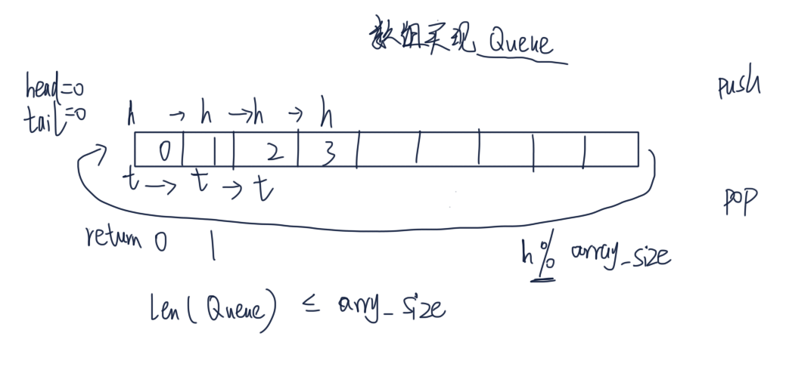

# 队列和栈

前面讲了线性和链式结构，如果你顺利掌握了，下边的队列和栈就小菜一碟了。因为我们会用前两章讲到的东西来实现队列和栈。
之所以放到一起讲是因为这两个东西很类似，队列是先进先出结构(FIFO, first in first out)，
栈是后进先出结构(LIFO, last in first out)。

生活中的数据结构：

- 队列。没错就是咱平常排队，第一个来的第一个走

本章我们详细讲讲常用的队列

# 队列 Queue

这里卖个关子，如果你熟悉了上两节讲的内容，这里你会选取哪个数据结构作为队列的底层存储？
还记得第一章讲的如何实现 ADT 吗？我视频了说了三个注意事项：

- 1.如何选用恰当的数据结构作为存储？
- 2.选取的数据结构能否满足 ADT 的功能需求
- 3.实现效率如何？

我们先来看看 list 可以不？对照这个三个需求，看看能否满足：

- 1.我们选择了 list
- 2.看起来队列需要从头删除，向尾部增加元素，也就是 list.insert(0, element) 和 list.append(element)
- 3.嗯，貌似 list.insert(0, element) 会导致所有list元素后移，O(n)复杂度。append 平均倒是O(1)，但是如果内存不够还要重新分配内存。

你看，使用了 list 的话频繁 insert(0, element) 和 append 都是非常低效的。

脑子再转转， 我们第二章实现了 链表 LinkedList，看看能否满足要求：
- 1.这里选择 LinkedList
- 2.删除头元素 LinkedList.popleft()，追加 append(element)。都可以满足
- 3.哇欧，这两个操作都是 O(1) 的，完美。

好， 就用 LinkedList 了，我们开始实现，具体看视频。这次实现我们还将演示自定义异常和测试异常。


# 用数组实现队列

难道用数组就不能实现队列了吗？其实还是可以的。只不过数组是预先分配固定内存的，所以如果你知道了队列的最大长度，也是
可以用数组来实现的。

想象一下，队列就俩操作，进进出出，一进一出，pop 和 push 操作。
似乎只要两个下标 head, tail 就可以了。 当我们 push 的时候赋值并且前移 head，pop 的时候前移 tail 就可以了。你可以在纸上
模拟下试试。列队的长度就是 head-pop，这个长度必须不能大于初始化的最大程度。

如果 head 先到了数组末尾咋办？重头来呗，只要我们保证 tail 不会超过 head 就行。

head = 0,1,2,3,4 ... 0,1,2,3,4 ...

重头再来，循环往复，仿佛一个轮回。。。。
怎么重头来呢？看上边数组的规律你如果还想不起来用取模，估计小学数学是体育老师教的。

```py
maxsize = 5
for i in range(100):
    print(i % maxsize)
```



我们来实现一个空间有限的循环队列。ArrayQueue，它的实现很简单，但是缺点是需要预先知道队列的长度来分配内存。


# 双端队列 Double ended Queue
看了视频相信你已经会实现队列了，你可能还听过双端队列。上边讲到的队列 队头出，尾尾进，我们如果想头部和尾巴都能进能出呢？
这就是双端队列了，如果你用过 collections.deque 模块，就是这个东西。他能高效在两头操作。

假如让你实现你能想起来嘛？
似乎我们需要一个能 append()  appendleft() popleft() pop() 都是 O(1) 的数据结构。

上边我们实现 队列的 LinkedList 可以吗？貌似就差一个 pop() 最后边的元素无法实现了。
对，我们还有双端链表。它有这几个方法：

- append
- appendleft
- headnode()
- tailnode()
- remove(node)    # O(1)

啊哈，似乎删除头尾都可以啦，而且都是 O(1) 的，完美。
交给你一个艰巨的任务，实现双端队列 Deque（） ADT。你可以参考前几章的任何代码，挑战一下这个任务，别忘记写单元测试呦。当然如果没想出来也没关系，后边我们实现栈的时候还会用到它，那里我们会实现这个代码。


# 思考题
- 你能用 python 的 deque 来实现 queue ADT 吗？
- 哪些经典算法里用到了队列呢？
